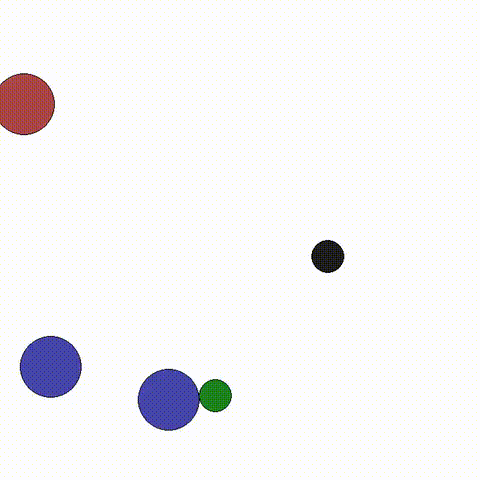
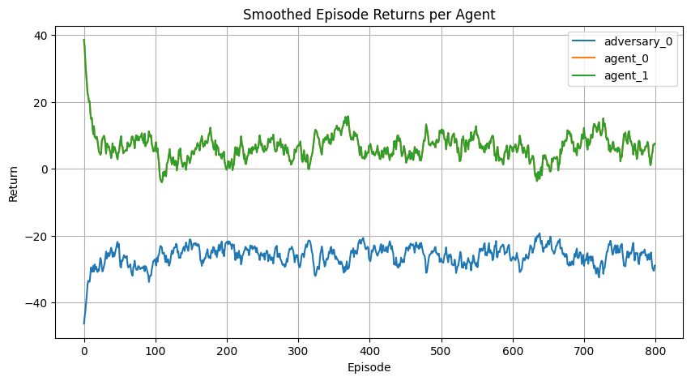
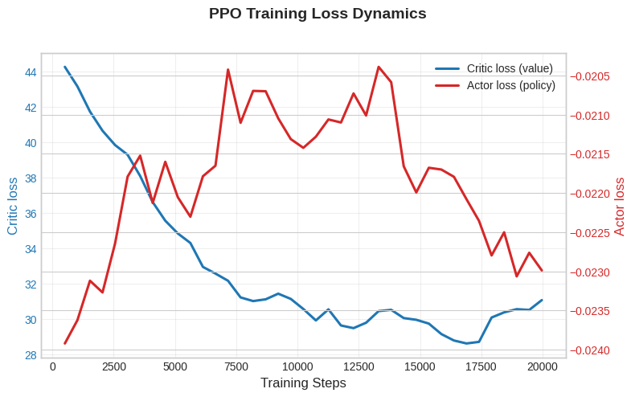

# Dynamic Games Solver
### *The first public reinforcement learning–based solver for dynamic Nash and Stackelberg games.*

---

## Overview

### 1.1 Motivation
Dynamic game theory provides the mathematical foundation for modeling multi-agent decision-making where actions unfold over time. Traditionally, solving for the equilibria or optimal policies for such games has relied on tools from **optimal control and optimization**, such as:

- Dynamic Programming  
- Karush–Kuhn–Tucker (KKT) conditions  
- Iterative Linear Quadratic (iLQ) approximations  

While these methods have contributed immensely to theoretical understanding, they remain **limited in practice** due to their dependence on linearity assumptions, differentiability, continuous control, or closed-form dynamics.

---

### 1.2 Project Introduction
**Dynamic Games Solver** introduces a new, practical way to compute equilibria in multi-agent dynamic systems — **through reinforcement learning (RL)**.

Instead of solving high-dimensional optimization problems directly, this solver learns equilibrium policies via **Proximal Policy Optimization(PPO)**, allowing it to handle **nonlinear, stochastic, and discrete** environments.

It provides a unified framework for:
- **Dynamic Nash games** – where all agents make simultaneous decisions each step.  
- **Dynamic Stackelberg games** – where hierarchical leader–follower structures exist among agents.  

The solver integrates these seamlessly using a flexible **decision hierarchy list**, so that specifying:
```python
args.action_sequence = [["leader"], ["follower1", "follower2"]]
creates a Stackelberg structure, while:
args.action_sequence = None
```
defaults to a standard Nash setting.

This framework enables **dynamic game theory research** to move beyond analytic models, allowing experiments in any PettingZoo-compatible environment, or even custom continuous/discrete setups.
It removes the computational barriers that previously made dynamic game analysis impractical — making **RL-based equilibrium computation** widely accessible to researchers.

###  1.3 Key Features
| Feature | Description |
|  **Unified Solver** | Handles both Nash and Stackelberg dynamic games in a single RL framework. |
|  **PPO-based Optimization** | Finds equilibrium strategies using Proximal Policy Optimization for stability. |
| **Flexible Decision Hierarchies** | Define any leader–follower order with `action_sequence`, or run simultaneous (Nash) play. |
|  **PettingZoo Integration** | Works with any valid PettingZoo environment (MPE, Atari, custom). |
|  **Logging & Analysis** | TensorBoard integration for rewards, losses, and gradient diagnostics. |
|  **Training History Export** | Saves `.json` and `.npz` logs for easy post-training analysis and reproducibility. |

---

##  2. Algorithms Implemented

###  2.1 PPO Foundation
Built upon the **Proximal Policy Optimization (PPO)** framework for stable policy-gradient learning.  
Implements minibatching, GAE, and entropy regularization.

### 2.2 Nash-PPO
- Agents act *simultaneously* each step.  
- Each policy optimizes its own return assuming others act concurrently.  
- Equivalent to finding a dynamic Nash equilibrium in policy space.

###  2.3 Stackelberg-PPO
- Agents act *sequentially* within each step (leader → follower).  
- Later agents condition their policies on earlier agents’ one-hot actions.  
- Enables hierarchical control and sequential best-response learning.

---

## 3. Installation

### 3.1 Requirements
```bash
python >= 3.10
torch >= 2.0
pettingzoo >= 1.24
numpy
tensorboard
tqdm
```

### 3.2 Setup
```bash
git clone https://github.com/namwook0921/dynamic-games-RL.git
cd dynamic-games-RL
pip install -r requirements.txt
```
### 3.3 Repository Structure
```csharp
dynamic-games-RL/
│
├── marl/
│   ├── agents/
│   │   ├── ppo_base.py
│   │   ├── nash_ppo.py
│   │   └── stackelberg_ppo.py
│   ├── utils/
│   └── __init__.py
│
├── examples/
│   ├── pettingzoo_pong_demo.py
│
├── runs/                 # TensorBoard logs
├── training_history/     # Saved histories (.npz / .json)
└── README.md
```

## 4. Usage

### 4.1 Running Training Scripts
To launch training on a PettingZoo environment:
```bash
python examples/pettingzoo_pong_demo.py
```
You can also run custom environments by modifying the example scripts.

### 4.2 Configuring Hyperparameters

You can configure PPO and game parameters using the TrainingArgs class:
```python
from marl.agents.ppo_base import TrainingArgs

args = TrainingArgs(
    total_timesteps = 1e5,
    num_steps = 128,
    num_epochs = 4,
    lr = 3e-4,
    action_sequence = [["leader"], ["follower1", "follower2"]]  # Stackelberg hierarchy
)
```

If ```action_sequence is None```, all agents will act simultaneously, corresponding to a Nash setting.

### 4.3 Logging and Visualization

Training logs and metrics are automatically recorded in the runs/ directory.
To visualize training progress, use TensorBoard:

```bash
tensorboard --logdir runs/
```

This will show plots for actor and critic losses, entropy, gradient norms, and per-agent returns.

## 5. Architecture

### 5.1 Agent and Environment Design

- Each agent has an independent actor–critic policy network.

- ~~The network architecture automatically adapts to the observation type:~~

  - ~~Convolutional networks (CNNs) for image observations.~~

  - ~~Fully connected networks (MLPs) for vector observations.~~
  (Not yet implemented)

- In Stackelberg games, follower agents receive additional one-hot encoded representations of the leaders’ actions.

### 5.2 Training Loop

- The solver interacts with PettingZoo environments using the parallel API.

- Rollouts are collected for all agents and stored in a shared buffer.

- PPO-style updates are applied per agent, respecting the hierarchical decision order specified in action_sequence.

### 5.3 Update and Minibatch Mechanics

- Supports both full-batch and minibatch PPO updates.

- Normalizes advantages for stable gradient estimation.

- Applies entropy regularization and value clipping.

- Records gradient magnitudes for both the shared trunk and actor/critic heads for diagnostic purposes.

## 6. Examples

### 6.1 PettingZoo MPE: `simple_adversary_v3`

Below is a rollout from a trained Stackelberg policy in the `simple_adversary_v3` environment.
In this setting, `adversary_0` moves first, and then `agent_0` and `agent_1` respond with access
to the adversary’s chosen action (hierarchical / leader–follower play):



We train directly on the PettingZoo-style parallel API:

```python
from mpe2 import simple_adversary_v3

env = simple_adversary_v3.parallel_env(
    N=2,
    max_cycles=25,
    continuous_actions=False
)
env.reset(seed=42)
```

Stackelberg hierarchy: adversary is the leader,
both good agents are followers responding in the same tier.

``` args.action_sequence = [["adversary_0"], ["agent_0", "agent_1"]] ```

Nash baseline: everyone acts simultaneously.

```bash args.action_sequence = None```

### 6.2 Training performance

Smoothed episodic returns per agent across training:



The PPO update terms (policy loss, value loss, entropy bonus) stay stable during training:




[Colab demo coming soon]

## 7. License

MIT License © 2025 Andrew Lee

## 8. Contact

Author: Andrew Namwook Lee

Email: namwook0921@berkeley.edu
